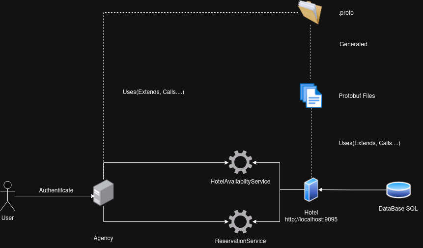

# TP4 Archi_Dis 
## **gRPC Web Services**

### **Project Overview**
This project is the fourth assignment (TP4) for the course **HAI704I** at the **University of Montpellier**. It involves implementing a **hotel reservation system** using **gRPC web services**, which is designed to be scalable and distributed. 

The first step is to replicate the implementation from **TP2** or **TP3**, but using **gRPC** instead of **REST** or **SOAP** ([Link to TP2 SOAP](https://github.com/malik-mnsr/TP2_Archi_Dis_SOAP)), ([Link to TP3 REST](https://github.com/malik-mnsr/TP3_Archi_Dis_REST)) 

Additionally, a **web service** will be created to **compare prices** from different agencies and display them on the **command-line interface (CLI)**. This will allow clients to choose the best offer before making a reservation.

### **High-Level Architecture**


### Prerequisites

Before setting up the project, make sure you have the following installed:

- **Java 8 or higher**: This project uses Java to run.
- **Apache Maven**: Used for managing the build and dependencies.
- **gRPC**: The project relies on gRPC for remote procedure calls.
- **Protobuf compiler (`protoc`)**: Used for generating Java code from `.proto` files.

### Clone the Repository

First, clone the repository to your local machine:

```bash
git clone https://github.com/malik-mnsr/TP4_Archi_Dis_gRPC.git
cd TP4_Archi_Dis_gRPC
```

The implementation is divided into three main parts:

### A. Common Module

The **Common Module** contains the `.proto` files that define the gRPC service and message types. Maven, using the `protobuf-maven-plugin`, will automatically generate Java files for both the gRPC service classes and message types.

These files are essential for implementing the server-side and client-side logic for your gRPC services.

#### **A. Server Module**
#### **A. Agency Module**
